# **Не твои ключи — не твои биткоины — настройка кошелька Electrum**

Я решил создать ряд базовых материалов, которые введут Биткоин-новичков в курс дела. Мы создадим горячий Биткоин-кошелек, научимся пользоваться аппаратным кошельком, соберем полную ноду, взглянем на несколько интересных аппаратных решений для Биткоина и многое другое.

Перед вами текстовая версия гайда, а видеоверсия доступна на YouTube канале 21идея: https://youtu.be/-wya0DhbV0g

Итак, сегодня я предлагаю разобрать создание горячего Биткоин-кошелька. Я уже слышу критику со стороны некоторых зрителей и также разделяю мнение, что основное количество своих Биткоин-сбережений нужно ОБЯЗАТЕЛЬНО хранить в холодном хранилище, но большинство, собственно, включая меня, на первых этапах знакомства с Биткоином не бегут покупать аппаратный кошелек. И тем более экспериментировать с самостоятельной оффлайн генерацией кошельков не отважатся. Целью данного видео является научить биткоинеров-новичков создать кошелек и начать самостоятельно контролировать собственные приватные ключи, и, соответственно, свои сбережения, ведь как гласит затертая до дыр фраза: “Не твои ключи — не твои биткоины”.

Хочу вставить еще пару своих сатоши и ненадолго остановиться на значимости самостоятельного хранения биткоинов. Если тебе интересно подробнее погрузиться в эту тему, обрати внимание на эту [статью](https://www.21ideas.org/theory-security-bitcoin-wallets/). Но если в двух словах, то доверяя хранение своих биткоинов той или иной бирже вы по сути перестаете являться обладателем этих монет. Помимо этого биржу могут взломать — она в силу больших объемов хранящихся монет является гораздо более лакомой приманкой для хакеров, чем персональные кошельки. Взлом может также привести к утечке персональных данных и даже если ваши монеты и не будут утеряны, кому охота чтобы по даркнету гуляла информация о том, сколько у него биткоинов и где он живет? Короче говоря, переоценить значимость самостоятельного хранения собственных монет сложно, так что предлагаю перейти к самому простому варианту решения этой проблемы.

Ну а если ты уже прожженный биткоинер и настройка кошелька Electrum — а мы разберем данный базовый этап хранения биткоинов именно на этом программном кошельке — не представляется интересной, то прости, придется подождать следующих выпусков с более техническими гайдами, тем не менее, не забудь поделиться этим гайдом со своими друзьями-новичками! А всем остальным желаю приятного прочтения... ну что ж, начнем?

Первым шагом к настройке программного кошелька будет, конечно же, его скачивание с официального сайта Electrum - [https://electrum.org/](https://electrum.org/)

|  |
|:--:|
| _Сайт Electrum_ |

Здесь также немаловажен шаг проверки подлинности программного обеспечения путем сравнения GPG подписей. Это довольно комплексная тема и некоторые считают достаточным просто убедиться, что ПО скачано именно с официального сайта. Лично я проверяю подпись при каждом обновлении или скачивании ПО с открытым исходным кодом, но чтобы не затягивать этот гайд, и для тех, кто хочет разобраться в этом вопросе я предлагаю обратить внимание на [эту статью](https://coinspot.io/technology/bezopasnost/prostoj-sposob-proverit-podpisi-pgp-v-programmnom-obespechenii-bitcoina/).

После проверки соответствия подписи устанавливаем и открываем Electrum. Нас встречает окно, предлагающее выбрать существующий кошелек либо создать новый. Вы можете назвать новый кошелек как вам заблагорассудится. В рамках этого теста я назову новый кошелек Electrum test. И нажму далее.

|  |
|:--:|
| _Мастер установки Electrum_ |

Нам предложен выбор типа кошелька, который мы хотим создать. Мы можем создать стандартный кошелек, кошелек с двухфакторной аутентификацией, кошелек мультисиг ([статьи](https://www.21ideas.org/tag/multisig/) + [видео](https://www.youtube.com/watch?v=K2nyxlEkGts&t=491s)), а также у нас есть опция импортировать адреса или приватные ключи.

| 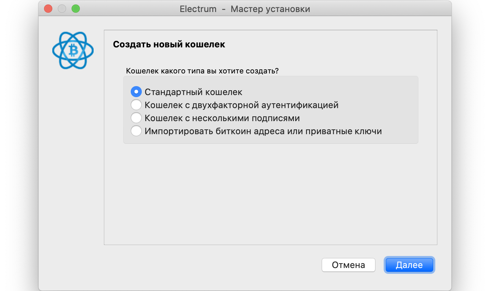 |
|:--:|
| _Выбор типа кошелька Electrum_ |

В рамках этого видео мы создадим стандартный кошелек. И перед нами появляются новые опции дальнейших действий. Выбираем “Создать новую сид-фразу”.

| 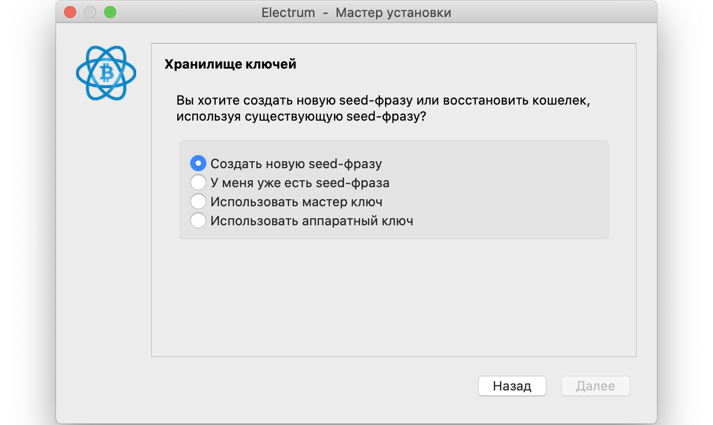 |
|:--:|
| _Хранилище ключей_ |

Далее нам необходимо выбрать тип кошелька. SegWit на сегодняшний день широко поддерживается сообществом и предлагает существенные улучшения, поэтому выбираем его.

| 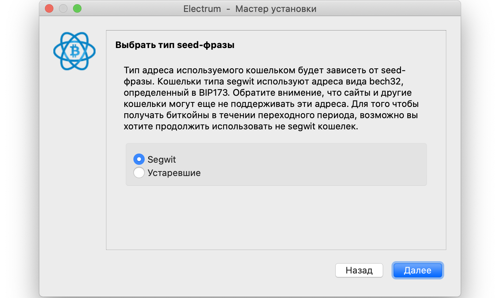 |
|:--:|
| _Выбор типа seed-фразы_ |

И кошелек предлагает нам записать сгенерированную сид-фразу. Это - пожалуй, самый важный шаг в создании кошелька и хранении биткоинов, так что я сакцентирую на этом внимание. Внимательно перепишите эти 12 слов на удобный вам оффлайн носитель. Советую сделать несколько копий сид фразы - это единственный ваш способ восстановить кошелек если с вашим компьютером что-то случится. Многие задумываются над сохранением сид фразы еще более тщательно и высекают их, например, на металлических пластинах, чтобы они могли противостоять стихийным бедствиям, таким как пожар или наводнение. На способах сохранения сид-фразы мы, возможно, остановимся подробнее позже, а пока возвращаемся к созданию кошелька.

|  |
|:--:|
| _Seed-фраза_ |

Под окошком с предложенной сид фразой мы видим кнопку “Опции”. Здесь нам предлагается опция добавления дополнительной фразы к нашей сгенерированной сид фразе. Сегодня предлагаю пропустить этот шаг, но суть здесь в том, что вы можете повысить сложность подбора вашей сид фразы. С опытом можно будет рассмотреть эту опцию.

|  |
|:--:|
| _Расширить seed-фразу_ |

Далее нам необходимо подтвердить правильность записанной нами сид фразы.

| 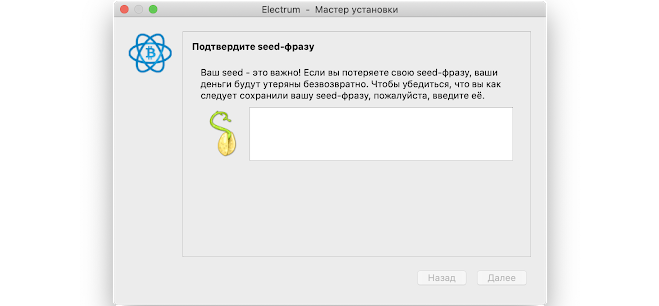 |
|:--:|
| _Подтверждение seed-фразы_ |

Вводим слова в предложенное окно в соответствующем порядке и нажимаем “Далее”.

| 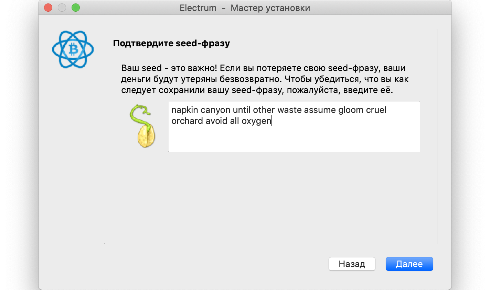 |
|:--:|
| _Подтверждение seed-фразы_ |

Теперь необходимо сгенерировать пароль для доступа к кошельку. В интернете можно найти уйму генераторов паролей с открытым исходным кодом. Здесь я не буду ничего советовать, главное - убедитесь, что пароль достаточно длинный и состоит из строчных и заглавных букв, цифр и символов. Я поделюсь табличкой, которая отлично поясняет почему это важно.

|  |
|:--:|
| _Сложность пароля_ |

Electrum сообщит насколько силен пароль и я советую стремиться к показателю Very Strong или “Очень надежный”.

| 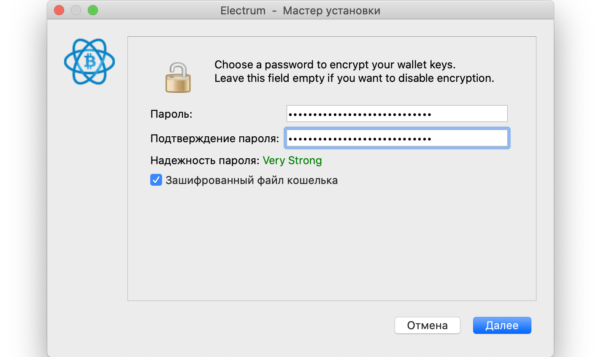 |
|:--:|
| _Ввод и подтверждение пароля_ |

Вуа-ля, кошелек создан. Во первых теперь в меню “Настройки” вы можете при необходимости сменить язык интерфейса. Помните, что для того, чтобы изменения вступили в силу необходимо будет перезапустить Electrum.

Количество вкладок, указанных в верхней части окна вашего кошелька может отличаться от того, что вы видите у меня. По необходимости вы можете добавлять или скрывать эти вкладки в разделе меню “Вид”.

| 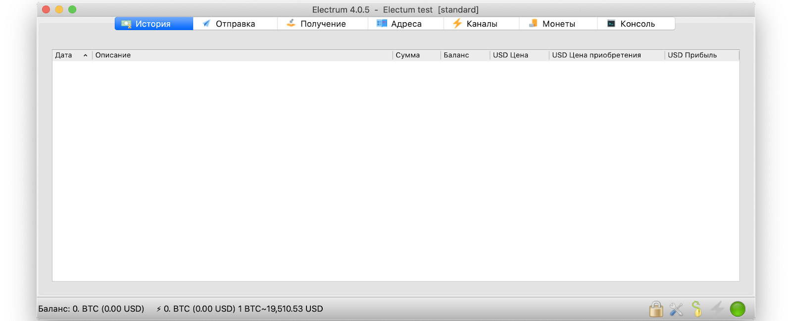 |
|:--:|
| _Окно Electrum_ |

Итак, предлагаю быстро пройтись по основным элементам интерфейса. Мы видим вкладку “История”, здесь будут отражаться все ваши транзакции. Вкладки “Отправка” и “Получение” говорят сами за себя. В нижнем левом углу мы видим наш текущий баланс как на мейннете - в основной сети, так и в сети лайтнинг. Справа внизу перед нами замок - тут можно сменить пароль. Настройки, возможность взглянуть на сид-фразу, информация о ваших каналах лайтнинг и индикатор подключения к сети, нажав на который можно узнать подробную информацию о сети и нодах, к которым вы подключены.

Начнем с настроек. Тут, как мы видели, можно сменить язык интерфейса, выбрать в каком виде будут отображаться ваши Биткоин-сбережения, например сатоши, и тему.

| 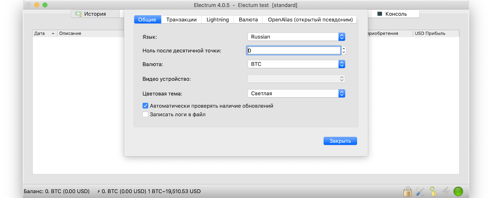 |
|:--:|
| _Настройки Electrum_ |

Во вкладке транзакции можно активировать функцию Replace By Fee, которая очень полезна когда мемпул Биткоина перегружен и ваша транзакция не проходит. RBF позволяет повысить комиссию майнерам когда транзакция уже находится в мемпуле. Также можно выбрать блок эксплорер - программу, на которую будет ссылаться Electrum при предоставлении вам данных о произведенных транзакциях.

|  |
|:--:|
| _Настройки транзакций_ |

Все опции предлагают пояснения при наведении на них мышью, так что проблем возникнуть не должно. Если у вас все же есть какие-то вопросы, пишите их в комментариях или лично мне в телеграм - постараюсь помочь каждому. Также есть настройки для тех, кто пользуется лайтнинг, об этом, опять же позже. В следующей вкладке “Валюта” можно выбрать привычную вам фиатную валюту, и настроить кошелек на то, чтобы он показывал курс BTC в выбранной вами валюте, выбрать источник данных о курсе, а также демонстрировать вашу прибыль и баланс в фиате во вкладках История и Адреса соответственно.

| 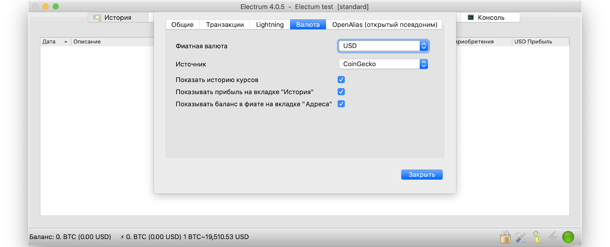 |
|:--:|
| _Настройки валюты_ |

Следующим важным шагом является создание резервной копии файла кошелька. Немного запутались? Я понимаю - у нас уже есть сид-фраза, пароль, а теперь появляется еще и файл кошелька. Зачем так много вещей и столько сложностей? Дело в том, что Биткоин еще очень молод. Поищите на просторах интернета видео использования имейл клиента в семидесятых и вы поймете, что мы сейчас находимся на схожей стадии - в самом начале пути. Тем более здесь речь идет о самостоятельном хранении нецензурируемых свободных децентрализованных денег без участия каких-либо третьих сторон. Подобные вещи по определению являются более комплексными. При этом пользу финансового суверенитета, как я уже говорил, переоценить сложно.

Так что предлагаю быстро разобраться с этими элементами и двигаться дальше.

-   Сид-фраза - это ваш запасной вариант для восстановления кошелька, если с ним что-то произойдет - ваш компьютер сломается или вы забудете пароль.
-   Пароль, как и в соц сетях, например, нужен чтобы открыть вашу учетную запись, а
-   Файл кошелька - это как бы зашифрованная программа, которую этот пароль и расшифровывает. Чтобы открыть кошелек на устройстве необходим сам файл, который мы хотим открыть и пароль чтобы расшифровать этот файл.

А если с файлом или паролем что-то случится - пароль можно потерять, а файл может быть случайно удален, восстановить ваш кошелек, кстати, используя практически любое Биткоин-ПО, можно при помощи сид-фразы. Ну что, ситуация прояснилась? Тогда поехали дальше!  

Итак, для создания резервной копии нам необходимо открыть пункт меню “Файл” и выбрать “Save backup”. У меня этот пункт почему-то не переведен на русский, но предположу, что при переводе он бы назывался “Сохранить копию” или “Создать резервную копию”.

|  |
|:--:|
| _Резервная копия_ |

Я настоятельно рекомендую пройти эту процедуру и сохранить копию файла кошелька на внешнем носителе на случай, если с оригинальным файлом что-то произойдет. Таким образом вам не придется использовать сид фразу, а достаточно будет лишь достать этот файл и использовать сохраненный пароль для доступа к средствам. Назовем файл кошелька “Electrum test copy”. Он сохраняется как любой другой документ - никакой ядерной физики.

| 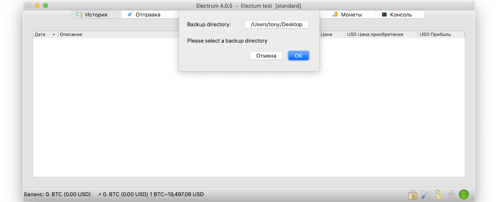 |
|:--:|
| _Резервная копия_ |

Теперь, если перезапустить Electrum, можно выбрать только что сохраненный кошелек и использовать с ним тот же самый пароль, что и в случае с оригиналом. Еще одна интересная особенность заключается в том, что кошелек, выбранный при запуске в последний раз будет предлагаться вам по умолчанию, а если вы удалите последний открытый кошелек или переместите его в недоступное место, вам предложат создать новый. Чтобы вернуться к предыдущей версии нужно нажать кнопку “Выбрать” и перед вами откроется папка Electrum, где хранятся все созданные файлы кошельков. В зависимости от операционной системы это может меняться, но в Мак ОС это работает так.

Ну что ж, пришло время поэксперементировать с получением и отправкой средств. Чтобы стать получателем транзакции в сети Биткоин необходимо перейти во вкладку “Получение” и нажать “Новый адрес” (New Address).

| 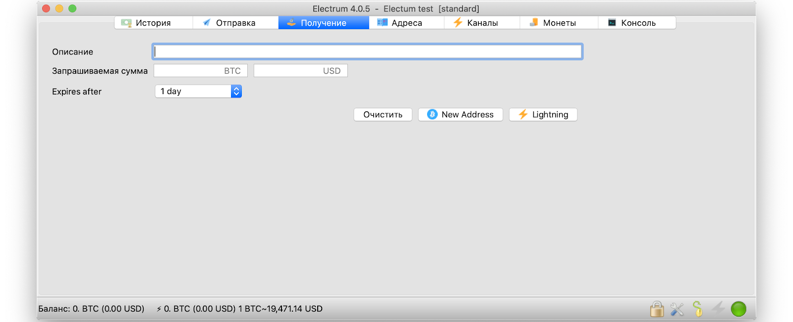 |
|:--:|
| _Получение средств в Electrum_ |

С недавнего времени Electrum также поддерживает сеть лайтнинг, но для получения лайтнинг-платежей необходимо сначала открыть канал, так что это материал для следующих видео на канале. Мы видим новый столбец в окне кошелька, где можно скопировать адрес либо сгенерировать QR-код. Вы также можете, скажем, “выписать счет”, указав количество биткоинов, которое желаете получить.

| 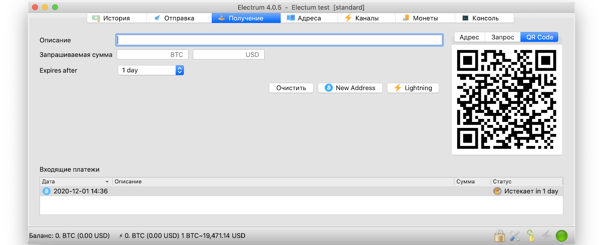 |
|:--:|
| _Получение средств в Electrum_ |

Альтернативно вы можете перейти во вкладку “Адреса” и скопировать любой адрес чтобы позже поделиться им с отправителем средств.

|  |
|:--:|
| _Адреса_ |

Итак, у меня сейчас в руках мобильный телефон с кошельком Blue Wallet. Я сканирую QR код и отправляю средства на кошелек Electrum. Средства получены и теперь мы переходим к обещанному сюрпризу. Чтобы отправить средства переходим во вкладку “Отправка”, вставляем нужный адрес и нажимаем “Оплатить”. Максимально просто.

| 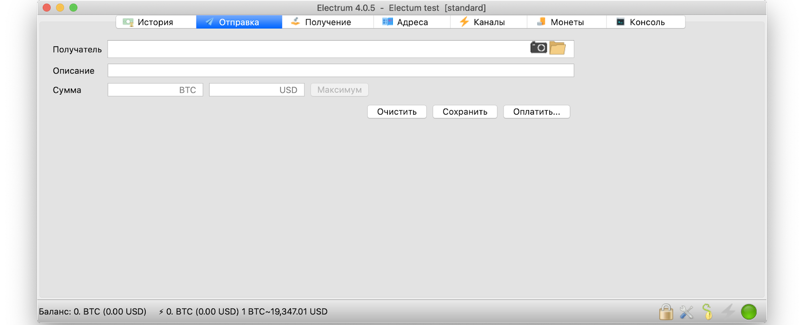 |
|:--:|
| _Отправка средств в Electrum_ |

Хочу обратить ваше внимание на 2 интересные фишки Electum’a: во-первых этот кошелек позволяет вам заплатить нескольким получателям одновременно, что снижает ваши транзакционные издержки. Для этого перейдите в пункт меню “Инструменты” и выберите опцию “Заплатить нескольким”. Осталось лишь ввести необходимые адреса - каждый с новой строки - и соответствующие суммы напротив каждого адреса. Вторая полезная функция - это возможность тратить монеты с определенного UTXO, то есть с определенного непотраченного транзакционного выхода. Сделать это можно из вкладки “Монеты” путем выбора желаемого выхода, клика на него правой кнопкой мыши и выбора опции “Spend”. Мы не будем сейчас сильно улглубляться в вопросы приватности, но эта функция позволяет значительно улучшить собственную гигиену взаимодействия с Биткоином и понизить шансы блокчейн-наблюдателей с уверенностью заявлять о принадлежности тех или иных монет. На сайте Bitcoin Translated есть перевод материала из Bitcoin wiki на тему приватности, всех заинтересованных приглашаю с ним ознакомиться [здесь](https://www.21ideas.org/practical-bitcoin-privacy-practices/).

|  |
|:--:|
| _Заплатить нескольким получателям_ |

Ну что ж, мы создали, настроили и разобрали основные функции кошелька Electum. В следующих гидах мы немного усложним наши задачи, но с повышением сложности придет и повышенная безопасность и приватность, так что следите за следующими выпусками!

---

Спасибо за внимание! Не забудьте поделиться этим материалом со знакомыми новичками и ноукоинерами — будьте уверены, что они вас позже обязательно поблагодарят.

Увидимся на той стороне кроличьей норы,

Искренне ваш,

Tony ₿